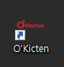
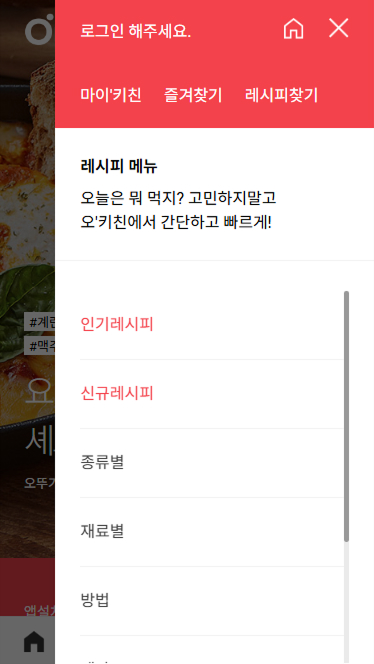
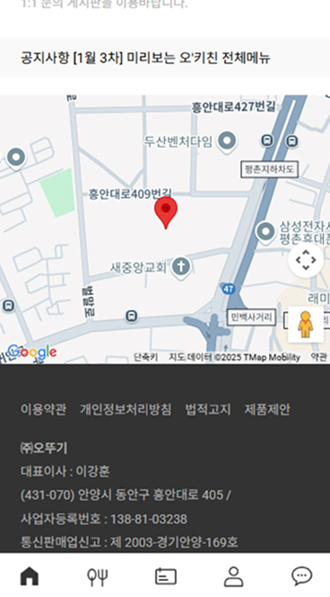
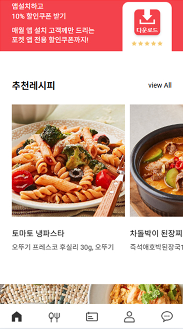

## 오뚜기 모바일 앱 프로젝트

모바일 친화적인 UI를 제공하는 오뚜기 웹앱 프로젝트입니다. <br>
Swiper.js를 활용한 슬라이더 구현과 반응형 메뉴 UI, Google Maps API를 연동하여 지점 정보를 제공합니다. <br>
PWA 빌더(https://www.pwabuilder.com/)를 이용하여 PWA와 연동까지 진행하였습니다. <br>
(*PWA이란 모바일 기기에서 네이티브 앱과 같은 사용자 경험을 제공하는 웹 앱입니다.)



<br/>

### 🎯 주요 기능

- 모바일 탭 메뉴 및 dim처리
- Swiper.js 기반 메인·서브 슬라이더
- 상품 슬라이드 (브레이크포인트 설정)
- Google Maps 연동

<br/>

### 🛠️ 사용 기술

| 기술 | 설명 |
|------|------|
|  | HTML5 마크업 구조 |
|  | CSS3 반응형 스타일 처리 |
|  | JavaScript DOM 제어, Swiper & GSAP 연동 |
|  | Swiper.js 슬라이더 구현 |

<br/>

### 📸 데모 이미지

| 모바일 메뉴 | 메인 슬라이더 | 구글 맵 API |
|-------------|----------------|-------------|
|  |  |  |


<br/>

### ⚙️ 기능 상세 설명

### ✅  1. 모바일 메뉴 (Tab Menu)
- 메뉴 버튼 클릭 시 모바일 메뉴가 오픈됩니다.
- dim 또는 닫기 버튼 클릭 시 메뉴가 닫힙니다.
- 오픈 시 `body`에 `fixed` 클래스 추가로 스크롤 방지합니다.


 ``` JavaScript
tab.addEventListener("click", function(e){
  e.preventDefault();

  document.body.classList.add("fixed");
  mobile.classList.add("active");
  dim.classList.add("active");
});

dim.addEventListener("click", function(){
  document.body.classList.remove("fixed");
  mobile.classList.remove("active");
  dim.classList.remove("active");
});

closeBtn.addEventListener("click", function(e){
  e.preventDefault();

  document.body.classList.remove("fixed");
  mobile.classList.remove("active");
  dim.classList.remove("active");
});
```

---

### ✅ 2. 메인 슬라이더 (#main_slider)

- 페이지 네비게이션(fraction)입니다.
- 좌우 버튼 제어가 가능합니다.


```javascript
	const mainSwiper=new Swiper("#main_slider .swiper-container", {
		navigation: {
			prevEl: "#main_slider .swiper-button-prev",
			nextEl: "#main_slider .swiper-button-next"
		},
		pagination: {
			el: "#main_slider .swiper-pagination",
			type: "fraction"
		}
	});
```

---

### ✅  3. 서브 슬라이더 (#sub_slider)

- 모바일 기준 1.5개 노출, 태블릿 이상에서 3.5개가 노출됩니다.
- 반응형 설정 포함합니다.



```javascript
	const subSwiper=new Swiper("#sub_slider .swiper-container", {
		slidesPerView: 1.5,
		spaceBetween: 10,
		breakpoints: {
			640: {
				slidesPerView: 3.5,
				spaceBetween: 5
			}
		}
	});
```

---

### ✅ 4. Google Maps API

- 중심 좌표: 오뚜기 위치 (위도: 37.3901, 경도: 126.9715)
- 마커 타이틀: (주)오뚜기


```javascript
function initMap(){
	let myLatLng={lat: 37.390141551118695, lng: 126.97151846772532};

	let map=new google.maps.Map(document.getElementById("map"), {
		center: myLatLng,
		zoom: 16,
		mapTypeControl: false,
		zoomControl: false,
		fullscreenControl: false,
		rotateControl: false
	});

	let marker=new google.maps.Marker({
		position: myLatLng,
		map: map,
		title: "(주)오뚜기"
	});
}
```
